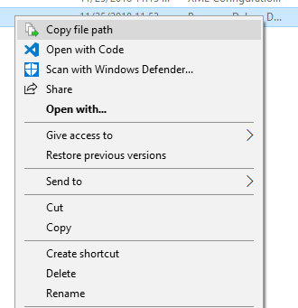

# CopyPath

Tiny .NET program that lets you copy the full path of a file/folder from within Windows Explorer.

## Build Instructions

* If you haven't already, install [Visual Studio 2017 or newer](https://visualstudio.microsoft.com/vs/).  When installing, make sure you select the required .NET framework tools (.NET Version 4.7.2 is recommended, but anything from 3.0 should work)
* Open file CopyToClipboard.sln
* Select Configuration "Release"
* Select Build > Build Solution
* The executable should be in bin/release/CopyToClipboard.exe

## Usage

* Run the executable once without any arguments in order to install the Windows Explorer Shortcuts.
* Open Windows Explorer
* Right-click any file or folder
* You should see an option like this: 

* Selecting the option should copy the path into your clipboard. The path will use forward-slashes instead of backward-slashes, so you can use it in a string without the need to escape it.
